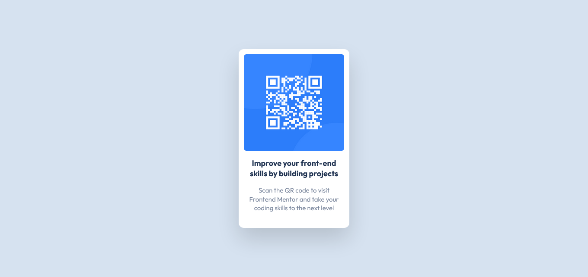

# Frontend Mentor - QR code component solution

This is a solution to the [QR code component challenge on Frontend Mentor](https://www.frontendmentor.io/challenges/qr-code-component-iux_sIO_H). Frontend Mentor challenges help you improve your coding skills by building realistic projects. 

## Table of contents

- [Overview](#overview)
  - [Screenshot](#screenshot)
  - [Links](#links)
- [My process](#my-process)
  - [Built with](#built-with)
  - [What I learned](#what-i-learned)
  - [Continued development](#continued-development)
- [Author](#author)

**Note: Delete this note and update the table of contents based on what sections you keep.**

## Overview

### Screenshot



### Links

- [Solution](https://www.frontendmentor.io/solutions/qr-code-component-tailwindcss-image-sizing-6YwBHpbAUS)
- [Live Site](https://stephenyu2018.github.io/qr-code-component-main/)

## My process

### Built with

- Semantic HTML5 markup
- CSS custom properties
- Flexbox
- Mobile-first workflow
- [TailwindCSS](https://tailwindcss.com/) - CSS Framework

### What I learned

I learned a lot about the TailwindCSS Framework. While I mostly learned basic syntax, I was also 
surprised about how customizable the framework was. It allowed me to add new colors & a font family 
to the `tailwind.config.js` file, which was very convenient as well.

TailwindCSS also allows opting into arbitrary values with `[<value>]`, where `<value>` represents a 
vanilla CSS value (followed by a unit if necessary).

Here are some examples where I used it in my code:

```html
<h1 class="... font-bold text-[18px] text-center ...">Improve your front-end skills by building projects</h1>
<p class="... font-normal text-[15px] text-center ...">
  Scan the QR code to visit Frontend Mentor and take your coding skills to the next level
</p>
```

Though it's definitely a last resort. It's important for me to think about whether such styles should 
be grouped into themes or if the default framework already provides a more convenient solution. 

### Continued development

I would like to focus more on sizing images properly & with responsive design in mind. I struggled a lot 
with getting the QR code image to be a square. I eventually got the image to display correctly on my 
screen, but the code implementing it is very tacky:

```html

```

As you can see above, I had to resort to TailwindCSS' arbitrary values just to get the correct height for 
the image to be a square. I initially tried `h-64`, but the image ended up being to tall. So I ended up 
settling on this, but the code no longer tells me that I'm trying to size the image as a square.

I also got confused with some of the syntax. I thought `border-r-4` had to do with border radius, but 
it actually meant this in vanilla CSS:

```css
.border-r-8 {
  border-right-width: 8px;
}
```

What I was really looking for was `rounded-xl`! 

Oh well. I'll get better at reading the syntax over time.

#### After Submitting

It seems that they were a few more things I forgot to consider. One of them was that my component size 
was much smaller than the original design. I should've paid more attention to the screen sizes for both
desktop & mobile.

Another big mistake was not considering accessibility. I specifically forgot to add alt text to the image 
and to explicitly state landmarks for acccessibility devices to work with.

## Author

Frontend Mentor - [@StephenYu2018](https://www.frontendmentor.io/profile/StephenYu2018)
